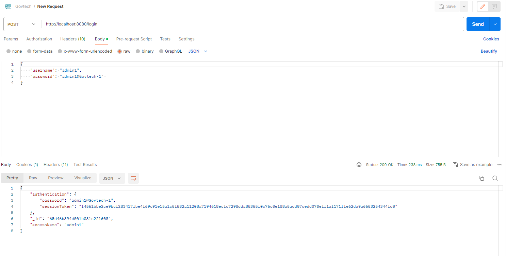
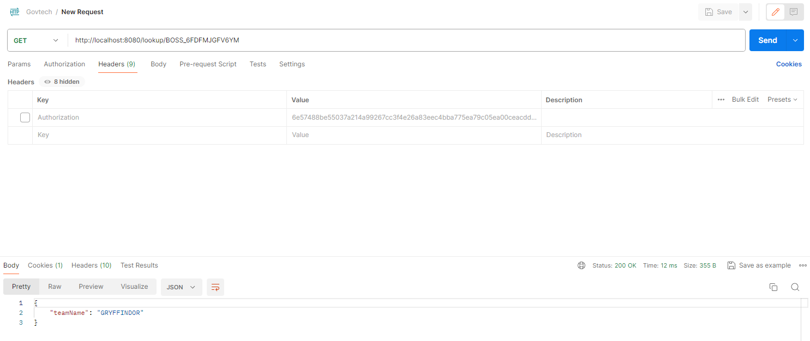
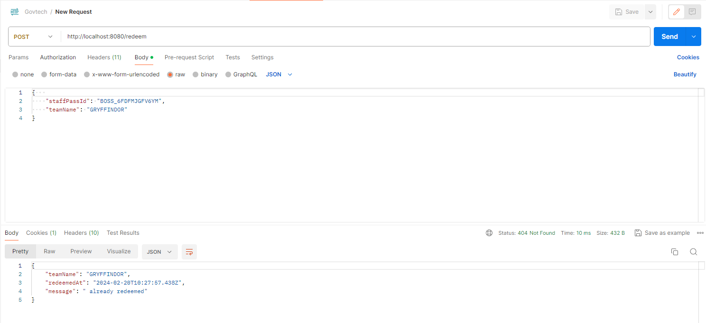

# GovTechAssessment - Tee Chang Zen

# Gift Redemption System for Christmas Season

## Overview
This project implements a system for managing the distribution of Christmas gifts to teams within a department. It allows representatives of each team to redeem their team's gift by verifying their identity through a staff pass ID. The system is built using Node.js and TypeScript and utilizes MongoDB for data storage.

## Assumptions
- **Predefined Admin Access:** Admin accounts are precreated (e.g., by an organization like GovTech) and distributed to authorized personnel. These accounts have rights to interact with mapping and redemption tables but cannot modify admin table entries.
- **Standard Operating Procedure (SOP):** Admins manually search for a team name based on the redeemer's ID and perform a separate query to check if the team has already redeemed their gift.
- **Additional Rights:** Admins can identify the staff member who redeemed a gift for a team, supporting claims of non-redemption. This utilizes the `getStaffIDByTeamName` method in `redemption.ts` for database queries.
- **Automatic Authentication:** The system automatically authenticates admin users before allowing lookup or redemption actions, without requiring a separate `/protected` authentication request.

## Features
- **Staff Pass ID Lookup:** Verifies the representative's staff pass ID against a mapping file.
- **Gift Redemption Verification:** Checks if the team has already redeemed their gift to prevent duplicate redemptions.
- **Redemption Record Addition:** Adds a new redemption record for eligible teams, ensuring each team only redeems their gift once.

## Database Collections Naming (IMPT PLS FOLLOW THE EXACT NAMINGS WHEN CREATING COLLECTIONS)
- `mapping`: Contains mappings of staff pass IDs to team names.
- `redemption`: Tracks the redemption status of each team, including the team name and redemption timestamp.
- `users`: Manages user access, including admin accounts with permissions to handle the system.

## Controllers
1. `authenticate.test.ts`: Middleware for user authentication. Cookies (sessionTokens) are used for authentication. 
2. `Login.ts`: Handles user login and session token management.
3. `Lookup.ts`: Facilitates the lookup of team names based on staff ID.
4. `Redeem.ts`: Manages the redemption process for teams.

# Setup Guide for Gift Redemption System

## Prerequisites
Ensure you have the following installed on your system:
- Node.js (v14 or later)
- npm (v6 or later)
- MongoDB (v4 or later)

## Installation Steps
**Clone the Project Repository**
   - Use Git to clone the project's repository into your local machine.
   ```bash
   git clone [repository URL]
   cd [project directory]

**Install Dependencies**
Run the following command in the project directory to install all required Node.js dependencies.
bash
Copy code
- npm install

**Configure MongoDB**
Install MongoDB and start the MongoDB service on your machine.
Create a new database for the project.
Modify the project's database connection file (usually found in config/db.js or similar) with your MongoDB URI, database name, and credentials.
javascript
Copy code to replace in ../src/server.ts file 
// Example
- mongoose.connect('mongodb://localhost:27017/yourdatabasename');

**Environment Variables (Optional)**
Set up environment variables for sensitive and configuration data. Create a .env file in the root directory.
Include variables for database connection or ports.

**Once configuration is complete, start the server with npm.**
bash
Copy code
- npm run start
- npm run test (to run unit tests)

**Verifying Installation**
After starting the server, navigate to http://localhost:8080 (or the port you configured) in your web browser to verify that the application is running.
Perform a test login using one of the precreated admin accounts to ensure the database connection and authentication flow are working correctly.

**Additional Notes**
Dependencies: This project uses specific Node.js libraries such as Express for the server framework, Mongoose for MongoDB object modeling. Ensure these are included in your package.json dependencies.
Security: Ensure your MongoDB database is secured and accessible only to authorized users. Use environment variables to store sensitive information like database URIs and keys securely.
Troubleshooting: If you encounter any issues with starting the server or connecting to the database, check the console output for errors. Common issues include missing dependencies, incorrect MongoDB URI, or port conflicts.

**How the initial endpoints should look**
REFER TO SCREENSHOTS





## Usage
- To perform operations such as login, lookup, and redeem, send HTTP requests to the respective endpoints with the required data.
